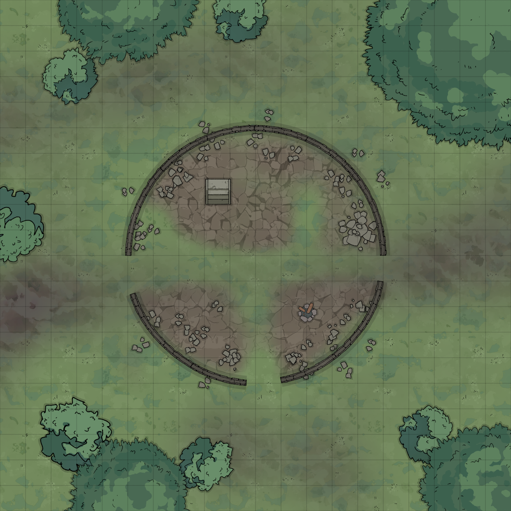

## Die Räuber vom Lyrkenfenn

### HÖRET, HÖRET!

**Mutige Helden gesucht, denn Belgor und seine brutalen Mannen plagen das Land! 200 GOLD für das Ausrotten der Räuberbande, die ihren Unterschlupf irgendwo im gefährlichen Sumpfgebiet Lyrkenfenn haben muss.**

  
(© Christian Kennig / [Die Räuber vom Lyrkenfenn](https://dungeonslayers.net/download/Dungeon2Go1.pdf) / angepasst von Ronin)

Nach Begegnungen/Hindernissen im Sumpf findet man auf einer felsigen Anhöhe eine Turmruine, von der nur noch das Erdgeschoß steht. Fußspuren deutlich erkennbar (GEI+VE+6) neben unzähligen frischen Feuerstellen samt Essensresten. Unter mit Flachs und Moos getarnter Luke (mit GEI+VE+2 entdeckbar) führt eine Treppe hinab.

  
(© Christian Kennig / [Die Räuber vom Lyrkenfenn](https://dungeonslayers.net/download/Dungeon2Go1.pdf) / angepasst von Ronin)

### 1. Wachraum

An einem Tisch, auf dem 4 Weinflaschen stehen (nur 1 noch voll; 1GM) schnarchen zwei betrunkene [Räuber](/fanwerk/bestiarium/raeuber.md) auf ihren Stühlen.

### 2. Leerer Raum

Ein Apfel liegt am Boden.

### 3. Lager

Hier lagern die Räuber 4x 10m Seil, 2 Laternen, 8x Lampenöl, 1 Eimer, 12x Waffenpaste in einer Holzschatulle, 14 Kurz-, 9 Langschwerter, 12 Dolche.

### 4. Fässer

Hier stehen 4 Bier- (je 5GM) und 2 Weinfässer (je 10GM). Auf einem Fass liegt ein Brecheisen (1GM).

### 5. Hundekammer

In dieser (von außen verriegelten) strohgefüllten Kammer halten die Räuber vier Bluthunde (wie [Wölfe](/grw/bestiarium/wolf.md)). Betreten SC den Gang vor der Tür, fangen die Tiere nach einer halben Minute (6Krd.) zu bellen an.

### 6. Kartenspiel

An fleckigen, wackeligen Holztisch sitzen [Räuber](/fanwerk/bestiarium/raeuber.md) (1/SC) und spielen Karten. Jeder hat W20KM, einer außerdem 2 sechsseitige Würfel.

### 7. Leerer Raum

Von Dieben nicht genutzt.

### 8. Vernagelte Tür

(haben Räuber kürzlich gemacht), dahinter alter Schrein einer dunklen Gottheit (errichtet von den Erbauern des Turmes), flankiert von zwei [Gargylen](/grw/bestiarium/gargyl.md) (greifen jeden im Raum an - nicht jedoch außerhalb), getrocknetes (Räuber) Blut am Boden.

### 9. Vorräte

Hier 6 Säcke Mehl, 2 Kisten (je W20 Äpfel), Sack Linsen, Sack Erbsen, an Decke 8x Schinken/Wurst.

### 10. Belgors’s Kammer

(verschlossen) [Belgor](belgor.md) schläft auf Decken, Eisentruhe (Belgor trägt Schlüssel) enthält 414KM, 313SM, 618GM, 2 Heiltränke, Kriegshorn.

### 11. Gefangene

Zwei geschundene, gefesselte junge Frauen (Überfallopfer) auf Fellen (8xW20SM). Heim bringen zu Familien gibt 40GM bzw. 6GM.

### 12. Schlafraum

Strohaufen und insgesamt 12 Decken. 1 Räuber/SC hier, davon Hälfte wach. Jeder W20KM, einer hat Ring (12GM) im Stiefel.

### 13. Fallgrube

Mehr als 2 SC hier: Mittig öffnet sich 2x2m Grube (4m tief).

### 14. Altes Labor

Tisch mit staubigen Alchimistenwerkzeug (50GM), rußge- schwärzten Schutzring +1 & 20 rote Pillen (Heilwert je 15) in einer kleinen Messingdose zwergischer Machart. Pentagramm am Boden (Betreten: W20/2 Jahre Alterung inkl. Bart- und Nagelwuchs).

### 15. Schatzkammer

In Truhe (Nadelfalle mit Gift 20) 2 Heiltränke, 1 Schwebetrank, mag. Krummdolch +1, 6 mag. Pfeilen (bei Aufprall [Feuerball](/grw/zauber/feuerball.md)), 18 Goldbarren (je 20GM) und Schriftrolle mit [Einschläfern](/grw/zauber/einschlaefern.md), 2x [Halt!](/grw/zauber/halt.md) und [Schweben](/grw/zauber/schweben.md).

### ERFAHRUNGSPUNKTE

> EP: Pro Raum 1EP  
> Pro Kampf (besiegte EP/SC)EP  
> Schrein vernichten 15EP  
> pro heimgebrachte Frau 10EP  
> Für das Abenteuer 25EP
