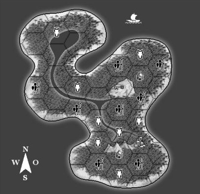
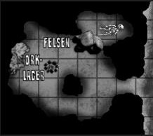

## Der Schatz der Banterra
Ein DS-Abenteuer von C. Kennig für die Stufen 9-12

Ein Pergament mit den Koordinaten einer Insel und einem Reim soll zum Schatz der Bannterra führen. Angeheuert (10% des Schatzes/Kopf) - oder auf Eigeninitiative - gehen die SC an Land, um den Schatz der Bannterra auf der Tropeninsel zu finden.

> Nördlich finde den süssen Wein und kehre zurück zu seinem Heim.
> 
> Beim gesunkenen Schiff im grünen Meer, wartet am Morgen hinter Fels der Redsame schon sehr.
> 
> Schließlich auf, zum Rand der Wellen aus Stein, halte aber von nun an trocken Deine Bein.
>
> Dann hoch zur Treppe ohne Ende, nur Mundgold durchdringt Wände.
>
> Doch nur ein Sklave kann bergen den Schatz, sonst wütet die Katz

**Hinweis:** Wird zuvor [Die Fracht der Bannterra (D2G4)](/abenteuer/d2go4/abenteuer-d2go4-die-fracht-der-bannterra.md) gespielt, kann das Pergament beispielsweise aus der Hutkrempe des Kapitäns ragen.

### Bedeutung des Reims
Der Reim besagt, man soll vom See im Norden (Nördlich finde den süssen Wein...) stromaufwärts (...kehre zurück zu seinem Heim...) ziehen. Bei der schiffsheckähnlichen Felsformation im Zentrum der Insel (Beim gesunkenen Schiff im grünen Meer...), wartet in einer Höhle im Osten (...am Morgen...) hinter Felsen der Redsame. Danach geht es zu den gewellten Bergen im Süden (...Wellen aus Stein...), zum Ostrand, nicht über den Fluß (...halte trocken Deine Bein).

### Auf der Insel
Ein Hexfeld entspricht 1 Meile. Wird ein Feld mit einem Symbol erstmalig betreten, kommt es zu einer Zufallsbegegnung auf untenstehender Tabelle. Der Fluß ist verschieden (5+W20/2)m breit und bis zu 5m tief. Bei jeder Flußüberquerung kommt es bei 1-10 auf W20 zu einer zufälligen Begegnung *Tiere (Ufer/Fluß)*.

### Dorf
Zwei verfeindete Eingeborenenstämme (alles **Kannibalen**) leben auf der Insel. Jedes Dorf besteht auf 15+W20/2 runden Bambushütten mit jeweils 1 Mann, 1 Frau und 1 oder 2 Kindern. Nur die Männer werden kämpfen. Pro 5 Hütten kann man neben wertlosen Alltagsgegenständen W20/2 Heilkräuter finden.

### Höhle
Schon von Weitem sieht man die Felsformation, die wie das Heck eines gesunkenen Schiffes aus dem Bäumen ragt. Ein eigentlich gut sichtbarer Höhleneingang an der steilen Ostwand wird ab 10m Entfernung vom Dickicht verborgen, man findet ihn also nur, wenn man auch nahe genug den Fels umrundet.

Ein gestrandeter Ork (besitzt nichts Wertvolles bis auf ein Messer) hat sich hier eingenistet, nicht ahnend, dass hinter großen, schweren (kombinierte ST von 15 nötig) Felsen (Wahrnehmung: Anderes Gestein als das der Höhle) ein Piratenskelett mit goldenem Schlüssel - im Mund versteckt - liegt (*...der Redsame hinter Fels...*).

### Schatz
An den östlichen, steilen Ausläufern der wellenförmigen Berge ist sehr leicht (Wahrnehmung+4) die Treppe ohne Ende auszumachen – natürliche, schmale Stufen führen etwa 12m an der steilen Wand empor und enden dort einfach. Wer hier sucht, findet in Kniehöhe eine Öffnung, in die der Schlüssel passt (... Mundgold durchdringt Wände...). Wird er gedreht, versinkt knirschend eine 2m² große Öffnung (mag.) im Boden (geht nur nach W20/2 h - von alleine - wieder zu).

Dahinter liegt nach 8m Tunnel der uralte Tempel eines Pantherkults, den die Männer der *Bannterra* einst fanden, seinen Mechanismus durchschauten und ihn fortan als Schatzkammer mißbrauchten. Pro Stunde 1-X auf W20 (X=h, die Tempel geöffnet), dass Eingeborene (4/SC) die Öffnung bemerken und nun anschleichen.

Nur wer gebückt - stets in Richtung des (heroischen) Steinpanthers blickend - den kreisrunden Bereich waffenlos betritt bzw. verlässt, kann Schätze entnehmen, ohne dass die Katze erwacht und jeden angreift.

> ## Der Schatz der Banterra
> 2000GM/SC, 3000SM/SC, 4000KM/SC, W20 Edelsteine/SC im Wert von je W20x20GM, mag. Krummsäbel +2, mag. Dolch +3, mag. Lederpanzer +3, schwarze Stiefel (permanent Wasser wandeln), mag. Goldohrring (akustische Wahrnehmung +2), 1 Wiederbelebungstrank, 14 Heiltränke, 10 Abklingtränke, 1 Miniaturkanonenkugel/SC (Werfen: Feuerball), Silberring (VE+1), Opalring (Abklingen-1), mag. Augenklappe (gleicht Malus durch Einäugigkeit aus), mag. Piratenhut (Schiff lenken +2), magisch sich füllende Rumbuddel (Abkling 1 Tag)

| W20   | Eingeborene                | Tiere (Ufer/Fluß)                                           | Tiere (Dschungel)                                  |
| ----- | -------------------------- | ----------------------------------------------------------- | -------------------------------------------------- |
| 1-5   | Spuren von Eingeborenen    | 1 hungriger [Alligator](/bestiarium/alligator.md)/SC        | 2 Panther/SC                                       |
| 6-10  | 1 Eingeborener verfolgt SC | 1 [Riesenschlange](/bestiarium/riesenschlange.md) im Wasser | 1 aggressiver Gorilla                              |
| 11-15 | 2 Eingeborene/SC           | 1 Kokosnüsse werfender Affe                                 | 1 Riesenschlange auf Baum                          |
| 16-20 | 3 Eingeborene/SC           | 1 Piranjaschwarm                                            | 1 [Monsterspinne](/Bestiarium/Monsterspinne.md)/SC |

Wird eine Begegnung abermals gewürfelt, entfällt sie und nichts geschieht.

| NSC                                             | LK                        | Abwehr | Angriff      | EP  |
| ----------------------------------------------- | ------------------------- | ------ | ------------ | --- |
| Affe                                            | 6                         | 2      | 11 Nuss      | 23  |
| [Alligator](/bestiarium/alligator.md)           | 81                        | 19     | 22           | 119 |
| Eingeborener                                    | 20                        | 10     | 11/11 Speer* | 69  |
| Gorilla                                         | 48                        | 15     | 18           | 97  |
| Panther                                         | 29                        | 9      | 14           | 65  |
| Pantherstatue                                   | 163                       | 20     | 19           | 413 |
| Piranjas                                        | abwehrlos Schlagen 20/Rd. |        |              | **  |
| [Riesenschlange](/bestiarium/riesenschlange.md) | 46                        | 14     | 16***        | 101 |

**Speer:** Bei 1. Treffer, falls dieser Schaden versusacht, KÖR+HÄ, sonst eingeschläfert  
**Piranha:** 1EP pro erhaltenen Schaden  
**Riesenschlange:** Biss: KÖR+HÄ sonst W20 Rd. 1 Schaden  

### Erfahrung
> EP: Pro Hex 5EP  
> Pro Kampf (besiegte EP/SC)EP  
> Reimrätsel persönlich lösen 15EP  
> Sklavenrätsellöser 100EP  
> Für Abenteuer 100EP  
