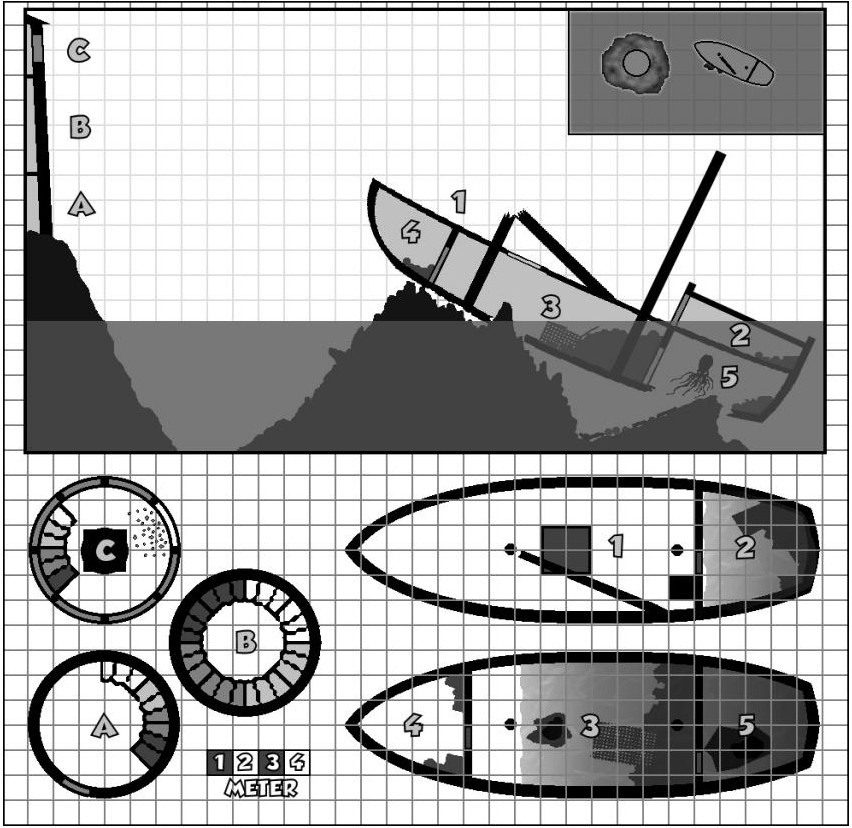

## Die Fracht der Banterra
Ein DS-Abenteuer von C. Kennig für die Stufen 1-4

Das Schiff wurde im nächtlichen Sturm gegen ein Riff bei der Leuchtturminsel geschmettert, doch gerade als im Morgengrauen die Rettungsboote auslaufen wollen, hört man einen unnatürlichen Schrei vom Wrack (SC mit Jäger I+ und Dschungelerfahrung vermuten einen Riesenaffen). Mutige Helden sind gefragt, dem unheimlichen Gebrüll nachzugehen.

> ### Tauchen
> SC kann KÖR+HÄ Runden die Luft anhalten ([Schwimmen](/grw/spielleitung-erweiterte-proben.md#schwimmen): Laufen/2), danach jede Runden eine KÖR+HÄ Probe, sonst jede Runde Angriff (zu Beginn mit 6; +2/weiterer Runden; Abwehr ohne PA).

### 1. An Deck 
Schiff mitgenommen und in Schieflage, Mast gebrochen (darunter 1 erschlagener Matrose mit Dolch und W20KM). Frachtluke zu 3. unverschlossen. Von hier sieht man 2 Matrosenleichen (mit eingeschlagenen Schädeln) ein Stück entfernt treiben.

### 2. Kapitäns Kajüte
Schreibtisch (in Schublade zerbrochene und zwei noch intakte Wasseratmungstränke (W20h)), Wandbehänge, Bett, Kissen, Decken, 4 Flaschen Elfenwein (je 10GM) und Karten & Logbuch (Tinte zerlaufen) haben den Kapitän unter sich begraben, der einen Schlüssel (siehe 3.), ein mag. Langschwert +1, einen Schutzring +1, einen goldenen Ohrring ([Wahrnehmung](/talente/wahrnehmung.md) +I) und einen federgeschmückten Krempenhut (Verhandeln +1, [evtl. Schatzkarte](/abenteuer/d2go12/abenteuer-d2go12-der-schatz-der-banterra.md)) noch bei sich hat.

### 3. Frachtraum
Alles heckwärts gerutscht und durchnässt: 28 Sack Korn, 14 Fässer Rum (5l je 1GM), 12 Krummsäbel aus dem Süden, Truhe mit 20 Goldbarren (je 20GM), 50 Fässer Bier (5l je 8SM) und ein von innen mit unglaublichen Kräften aufgebrochener 3x2x1m Käfig (der inzwischen nutzlose Schlüssel ist bei 2.). Tür zu 5. nach 4 Mannsstunden Arbeit freilegbar.

### 4. Kombüse
Maat liegt mit vom Sturz gebrochenem Genick zwischen Töpfen, Pfannen und Vorräten, darunter 12x Heikraut und Gewürze (8GM wert).

### 5. Mannschaftskabine
Ein [Tintenkraken](/bestiarium/tintenkraken.md) sieht seine Mahlzeit (4 unter der Decke treibende Matrosenleichen) bedroht und greift Eindringlinge an.

### Der Leuchtturm
Der aus dem Schiffskäfig entflohene [Riesenaffe](/bestiarium/riesenaffe.md) schaffte es auf die Leuchtturminsel. Er kletterte außen hoch und zerschmetterte ein Fenster der Leuchtfeuerkammer (C), wobei er sich am Glas Schnitt (der Schrei, den man am Morgen hörte). Rasend vor Wut und Schmerz sprang er das Treppenhaus (B) hinab, erschlug den alten Leuchtturmwärter und verwüstete dessen Wohnetage (A). Die Turmtür ist verriegelt.

Der Riesenaffe sollte nicht gleich entdeckt werden - da er schnell klettert und das Fenster offen ist, kann kurz etwas Katz-und-Maus gespielt werden, bevor er dann plötzlich angreift.

> Die Stadt beansprucht 90% <u>der</u> Fracht für sich.

### Erfahrung
> EP: Pro Raum 1EP
> Pro Kampf (besiegte EP/SC)EP
> Fracht bergen 20EP
> Fracht erfolgreich unterschlagen 1EP/20GM
> Für Abenteuer 15EP
