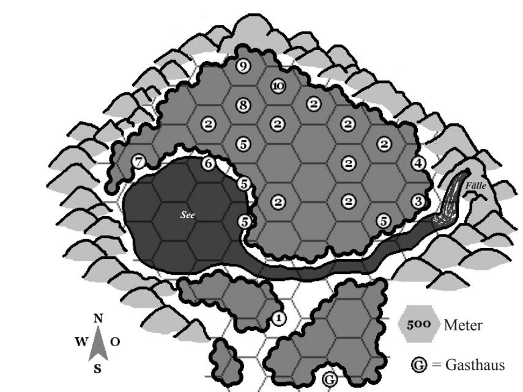

## Die Nacht der Verdammten
Ein DS-Abenteuer von C. Kennig für die Stufen 9-12

In der Nacht der Verdammten, in der angeblich den bösen Göttern geopfert und gehuldigt wird, erreicht man ein einsames Waldgasthaus. Zunächst von den abergläubischen Insassen eingelassen nicht (man könnte ein Ungeheuer sein), erfährt man unter Tränen, dass die Wirtstochter Dama nicht vom Kräutersammeln heimkehrte. Man vermutet dahinter die nördlich der stromaufwärts liegenden Wasserfälle lebenden Orks, welche man von den Spinnen vom Westufer des Sees ausgerottet glaubte, die dem geheimnisvollen Druiden dienen, der irgendwo im Wald lebt. Hilfsbereite erhalten Blendlaterne und Aussicht auf die 118 vom Wirt ersparten GM.

### 1. Kräuterwiese
Erfolgreiches Suchen führt zu einem leeren (!) Kräuterbeutel, der ordentlich verstaut (!) am Ufer liegt, weibliche Fußspuren daneben führen (nicht wieder findbar) in den Fluß.

### 2. Dichter Wald
Durch umgestürzte Bäume, zu dichtes Unterholz & Stolperwurzeln. Vorankommen hier fast unmöglich.

### 3. Toter Ork
Frisch verkohlter Ork auf verbrannten Grund (Feuerball).

### 4. Orklager
Alte Turmruine, wo außer 2 Speeren und 2 Keulen noch 1 tote Monsterspinne liegt (Speer im Kopf). Boden zerwühlt, keine weiteren Spuren, Vor Turm steht alte Steingötze böser Götter, die nach NW zeigt,

Im Keller Felldecken (samt Flöhe). Essensreste & halb verspeister Fuchs. Hinter Geheimtür (Orks nicht bekannt) alte Waffenkammer mit Rüstung des Schützen und Langbogen mag. +1 mit [Fieser Schuβ I](/talente/fieser-schuss.md), sowie vier *groβe* Heiltränke (2W20).

### 5. Wölfe
Bei 1-5 auf W20 greifen W20 [Wölfe](/bestiarium/wolf.md) die Charaktere plötzlich an (im ganzen Abenteuer nicht mehr als 20).

### 6. Paddelboot
Trägt bis zu 4 Charaktere.

### 7. Spinnenlager
Überall Spinnenetze und eingespinntes Waldtieraas vor muffiger Höhle. Keine Spinnen hier. Spuren lesen verrät, dass diese mit 2+ Humanoiden Richtung Orks zogen. Alte Steingötze böser Götter, die nach NO zeigt, steht eingespinnt vor Höhle.

### 8. Druidenhütte
Primity und derzeit verlassen. Decke, Holzklotztisch, Schale mit Waldbeeren. Unter dem Tisch Geheimfach, darin Buch über Dämonen (Beschwörenzauber +1) und 500GM-Steckbriefeines Dämonologen namens Arken Beijl aus naher Stadt.

### 9. Schlafender Riese
Wahrnehmungs-Proben, um zu bemerken, dass hier (seit über 100 Jahren) ein planloser, inzwischen zugewachserner [(Wald)Riese](/bestiarium/riese.md) ruht. Erwacht, sollte er Schaden nehmen.

### 10. Steinkreis
Hier kreuzen sich die gezeigten Richtungen der Statuen von 4&7. [Arken Beijl](arken-beijl.md), angeblicher Druide (in Wahrheit ein untergetauchter Dämonologe) und seine mordlustige, ihm verfallene Geliebte Dama, schlitzen gerade im Fackelschein dem ersten der gefesselten [Orks](/bestiarium/Ork.md) (1 pro SC) die Kehle auf, woraufhin krachend zwischen den Pranken einer Steingötze in der Kreismitte ein gewaltiger Dämon erscheint. Alle 5 Runden wird Arken den nächsten Ork töten und ein weiterer Dämon erscheint. Sind alle Orks tot/Dämonen erschienen.

Die flugfähigen Dämonen benötigen 2 Minuten dorthin, wüten dort weitere 2 Minuten und verschwinden. Arken kann sie bis dahin jederzeit wieder zu Hilfe holen oder Alternativ seine 40m entfernt im Dickicht lauernden [Monsterspinnen](/bestiarium/monsterspinne.md) (2 pro SC) rufen, während Dama (Schlagen 7, Abwehr 8, LK 18, EP 47) ihn wie eine verrückte Furie mit ihrem Kräutermesser verteidigen wird.

## Erfahrungspunkte
> Pro Kampf (besiegte EP/SC)EP  
> Götze vernichten je 25 EP  
> Gasthaus retten 100EP  
> Pro befreiten Ork 50/SC EP  
> Für Abenteuer 100EP  
