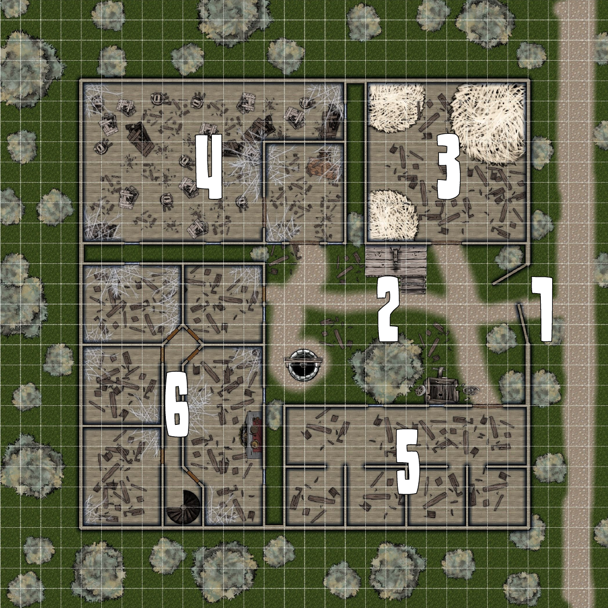
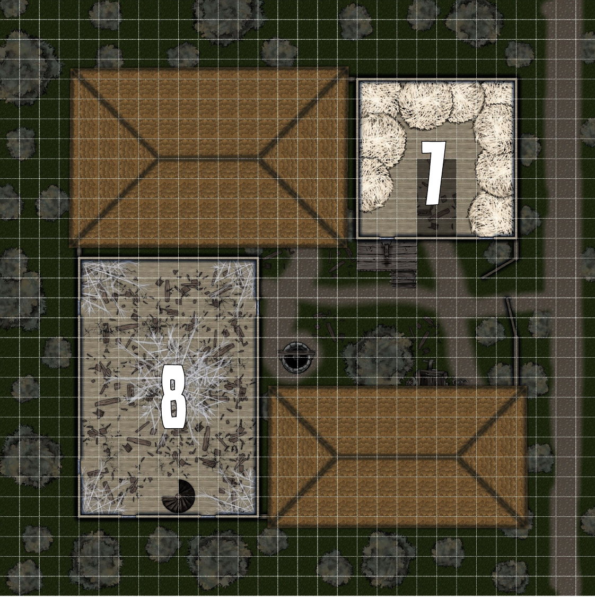
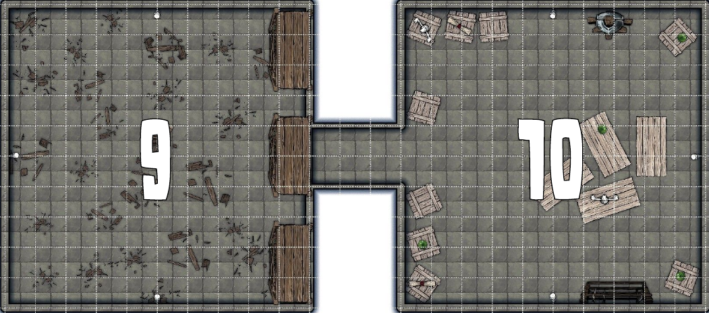

# DER ALTE HANDELSPOSTEN
Ein DS-Abenteuer von "Sintholos" für die Stufen 1-4

## EINLEITUNG
Handelsposten entstehen an Wegkreuzungen oder entlang stark befahrener Handelsstraßen. Dort werden die fahrenden Händler aber auch andere Reisende mit Schlafgelegenheiten, Lagermöglichkeiten und warmen Mahlzeiten versorgt, wenn sie sich auf den langen Weg von Stadt zu Stadt machen, um ihre Waren feilzubieten. 
Es kann jedoch vorkommen, dass ein Handelsposten verlassen wird. Der Wegfall von Kundschaft durch unsichere Straßen, günstigere Routen, Krieg oder Naturkatastrophen mag einen Handelsposten unrentabel machen und verfallen lassen. Dennoch können sie dem einen oder anderen Wanderer Unterschlupf bieten... und wilden Kreaturen ebenfalls.

## DAS ABENTEUER
Die SC stolpern entweder bei ihren Reisen über den al- ten Handelsposten und wählen ihn als Nachtlager aus, oder werden von einem NSC, der Interesse an dem al- ten Gebäudekomplex hat, ausgeschickt, um mal nach dem Rechten zu sehen, da eine Wiederbelebung des al- ten Handelsweges in der nahen Zukunft denkbar ist. Nähern sich die SC dem Handelsposten, sehen sie aus der Entfernung bereits einige Details des Komplexes: Er besteht aus mehreren Gebäuden und die Lücken zwischen den Gebäuden nach außen sind mit palisa- denartigen Wänden versperrt. Zugang gewährt nur ein offen stehendes Tor. Dunkle Fenster mit offenen Läden und das Geräusch von Zugluft empfangen die SC. Bei der Erkundung werden sie feststellen, dass der Handelsposten nun neue Bewohner hat: Ein paar Fledermäuse haben die alten Gebäude nun als Heimstatt auserkoren. Außerdem will ein Rudel Wölfe nach Ankunft der SC ebenfalls die Nacht im Handelsposten verbringen und wird während der Erkundung die SC überraschen. Und warum leuchten eigentlich die Augen der Wölfe so merkwürdig?

  
(von Sintholos)

## AUFBAU
### 1. TOR
Der einzige Zugang in den Hof des befestigten Handelspostens ist das offen stehende Tor. Die übrigen Lücken zwischen den Gebäuden sind durch dicke Palisadenwände versperrt, die, wenngleich sie einem richtigen militärischen Angriff auch nicht viel entgegenzusetzen haben, doch wilde Tiere effektiv abhalten können. Die Torflügel sind intakt, aber sehr schwergängig. Wollen die SC sie bewegen und schließen, so ist dafür eine Probe (Kraftakt – 8) notwendig. Verschließen die SC nicht das Tor werden ein paar Wölfe in den Hof eindringen können.

### 2. HOF
Auf dem Hof konnten reisende Händler ihre Waren feilbieten, erwerben oder warteten, bis die Betreiber des Handelspostens ihnen einen Platz zugewiesen hatten. Zerstörte Karren und Überreste von Kisten erinnern an einen hastigen Aufbruch der letzten Gäste. Ein provisorischer Galgen neueren Datums mit einem daran hängenden Toten weist darauf hin, dass der Handelsposten zwischenzeitlich weitere Bewohner fand. Eine Probe (Bemerken) offenbart eine Halskette („Schmugglerkette“) um den Hals des Gehängten. Haben die SC das Tor nicht verschlossen, treffen die SC hier auf ein Rudel von acht [Wölfen](/grw/bestiarium/wolf.md), die im Handelsposten Unterschlupf suchen wollen, wenn sie bei der Erkundung eines der anderen Gebäude verlassen. Während die Weibchen mit den Jungen Reißaus nehmen, werden SC Wölfe zurückbleiben um die SC zu bekämpfen. Die Wölfe versuchen dabei die ganze Zeit, sich den Fluchtweg aus dem Tor heraus offen zu halten. Stirbt ein Wolf, wird der Rest der Wölfe die Flucht antreten (Dennoch volle EP für die Wölfe verteilen!). Der Wolf bleibt jedoch nicht tot, sondern wird sich zum Schrecken der SC in einen [Unwolf](/grw/bestiarium/wolf.md) verwandeln und sich an den SC rächen.

### 3. SCHEUNE
In der Scheune wurden das Heu für die Versorgung der Tiere im Stall und die Lebensmittel des Handelspostens untergebracht. Eine herunterziehbare Leiter führt auf den Heuboden. Mit einer erfolgreichen Probe (Bemerken) können die SC den Eingang zu einem versteckten Keller unter dem verrotteten Heu und den morschen Bodendielen finden.

### 4. LAGER
Im Lager wurden wertvollere Güter untergebracht und gegen Aufpreis bewacht. Nun sind nur noch die Überreste einiger Kisten, Truhen und Regale im Raum verteilt. Das Lager ist offensichtlich hastig ausgeräumt und später vollständig geplündert worden.

### 5. STALL
Reit- und Zugtiere gehören zum Reisen auf Caera einfach dazu. Selbstverständlich müssen sie daher ebenfalls versorgt werden, wenn die Reisenden für die Nacht einkehren. In mehreren geräumigen Boxen konnten daher einige Pferde, Esel und Maultiere untergebracht werden.

### 6. HERBERGE - ERDGESCHOSS
In der Herberge wurden die Reisenden zur Übernachtung untergebracht. Sie besteht aus zwei Stockwerken. Im Erdgeschoss befanden sich die Einzelzimmer für wohlhabendere Gäste sowie eine recht kleine Schankstube, in der auf einer offenen Feuerstelle die Mahlzeiten für die Gäste gekocht werden konnten. Außerdem hatten hier die Betreiber des Handelspostens ihre kleinen Quartiere. Die Einrichtung der Räume ist jedoch zerstört und größtenteils verschwunden. Nur einige zertrümmerte Möbelreste lassen Rückschlüsse auf die ehemalige Einrichtung schließen.

  
(von Sintholos)

### 7. HEUBODEN
Über eine Leiter von der Scheune aus ist der Heuboden erreichbar. Unter dem Dach wurde das trockene Heu zwischengelagert, bis es von hungrigen Nutztieren verspeist wurde. Das zurückgebliebene Heu ist nun faulig und klumpig geworden und selbst die anspruchslosesten Tiere würden es verschmähen.
Ein Schwarm von [Vampirfledermäusen](/grw/bestiarium/vampirfledermaus.md) hat sich in der Zwischenzeit hier eingenistet. Der Großteil wird die Flucht durch das große Fenster zum Hof ergreifen, wenn die SC den Heuboden betreten. Vier besonders kämpferische Exemplare werden die SC jedoch angreifen.

### 8. HERBERGE - OBERGESCHOSS
Das Obergeschoss des Handelspostens ist ein großer Gemeinschaftsschlafsaal. Reisende, die nicht die Münzen für Einzelzimmer besitzen oder zu spät kommen und auf ausgebuchte Einzelzimmer stoßen, übernachten hier. Die Überreste von Strohmatratzen und dreistöckigen Betten sind noch in der geräumigen Kammer verstreut.
Ein Schwarm von [Vampirfledermäusen](/grw/bestiarium/vampirfledermaus.md) haust nun unter dem Gebälk. Der Großteil wird aufgeschreckt die Flucht durch das löchrige Dach antreten. Vier aggressive Exemplare werden die SC jedoch angreifen.

  
(von Sintholos)

### 9. KELLER
Der Keller war ursprünglich ein Lager für zu kühlende Lebensmittel. Diese sind bisher jedoch vollständig verdorben. Schaffen die SC eine Probe (Bemerken – 4), so erkennen sie den zweiten Zweck des Kellers. Versteckt hinter einem Regal und einer zusätzlichen eingezogenen Wand, befindet sich ein kurzer Geheimgang, der zum Schmugglerversteck des Handelspostens führt. Geöffnet werden kann der Geheimgang mit einer weiteren Probe (Mechanismus öffnen).

### 10. SCHMUGGLERVERSTECK
Das Schmugglerversteck enthält neben allerlei leeren Kisten zwei Schriftrollen (nach Tabelle Z), vier Tränke (nach Tabelle T), einen magischen Ring („Schmugglerring“) sowie je eine Rüstung und eine Waffe mit magischem Effekt (nach Tabelle W, R und E). Ansonsten können einige Wertgegenstände ohne praktischen Nutzen sichergestellt werden. (10A:15).

### Erfahrungspunkte:
Pro Kampf: (besiegte EP/SC)EP  
Pro untersuchtes Gebäude: 5EP  
Schmugglerversteck gefunden: 50EP  
Für das Abenteuer: 50EP  

## GEGENSTÄNDE
### SCHMUGGLERRING
**Ring (Heimlichkeit +I)**

**Schmuggler-Set**
- Schmugglerring
- Schmugglerkette
**Setboni** (kumulativ)
- 2 Teile: Diebeskunst +I

### SCHMUGGLERKETTE
**Kette (Beute schätzen +I)**

**Schmuggler-Set**
- Schmugglerring
- Schmugglerkette
**Setboni** (kumulativ)
- 2 Teile: Diebeskunst +I

# Quelle
[Der alte Handelsposten" von Sintholos](https://www.dropbox.com/s/ujx5bx4fn2ovnyb/Abenteuer%20Der%20alte%20Handelsposten.zip?dl=1)  
[Markdown](https://github.com/RoninEighty/Dungeonslayers/tree/main/abenteuer/der_alte_handelsposten)  
