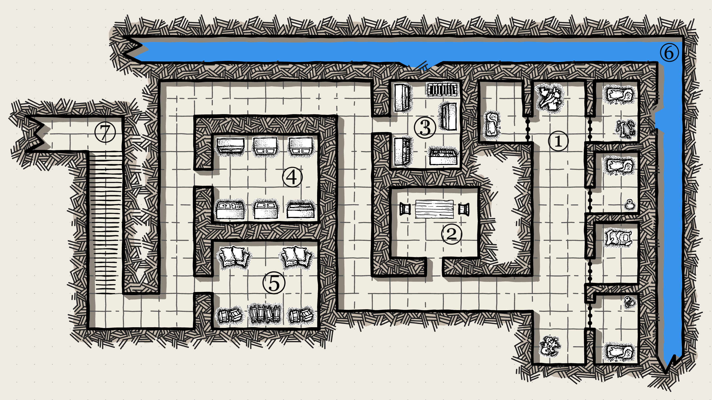

## Dungeon: Voll Verhaftet

### Einleitung

Die SC haben in der Taverne mal wieder Streit angefangen, die Stadtwache erfolglos bestochen oder zu viele Fragen beim korrupten Bürgermeister gestellt? Nun sitzen sie im Verlies der Stadtwache und wollen schnell wieder raus.

### Das Verlies

Die SC müssen sich befreien und fliehen. Das kann entweder über die Treppe nach oben, oder über die Kanalisation erfolgen. Sämtliche Ausrüstung wurde ihnen abgenommen. Zauberwirkern sind die Hände gefesselt (Zaubern -4). Besonders starke Zauberwirker sind zusätzlich geknebelt (Zaubern -8).

### Ablauf

Die SC sitzen in ihren Zellen. Die Wärter zeigen normalerweise kein Interesse an den Gefangenen, außer sie machen Ärger. Einmal pro Tag kommt eine Wache und bringt Essen und Wasser vorbei. Sie trägt einen Schlüssel am Gurt, welcher entwendet werden kann (Probe Taschendiebstahl -4). Das wird der Wache zeitnah auffallen. Mit einem erfolgreichem Nahkampf Angriff, kann die Wache überwältigt werden. Die SC können auch die Schlösser der Zellen knacken oder über die Kanalisation fliehen.

### Aufbau Verlies

#### 1. Die Zellen

In den Zellen liegen Rattenknochen. Die können als Dietrich verwendet werden um die Zellentür zu öffnen (SW 0) Die Wand in der nördlichsten Zelle ist bereits marode (Probe Bemerken). Mit einem Rattenknochen können die Steine herausgelöst (Probe GEI+GE), oder mit Gewalt herausgeschlagen werden (Probe Kraftakt). In einer der Zellen sitzt ein weiterer Gefangener. Er könnte den Hinweis für ein Abenteuer geben, oder den SC das Leben schwer machen und sie verraten, wenn sie ihn bei ihrer Flucht nicht mitnehmen.

#### 2. Wachraum

Hier sitzen zwei Wachen und spielen mit Würfeln. Entweder kommen die SC unbemerkt an ihnen vorbei (Probe Schleichen), oder sie werden anders abgelenkt.

#### 3. Lagerraum

Im Lagerraum wird die abgenommene Ausrüstung von Gefangenen verwahrt. Und zusätzlich noch 2 Dolche, 5 Hosen, 3 Hemden sowie 3 rechte und 2 linke Schuhe. Hier könnte auch ein für ein Abenteuer relevanter Gegenstand liegen. Es gibt einen Abfluss zur Kanalisation der verschlossen ist, aber von beiden Seiten geöffnet werden kann (SW 0).

#### 4. Ausrüstungsraum

In maroden Schränken liegen die Wappenröcke der Stadtwache. Mit ihnen lässt sich leichter an den Wachen im oberen Stockwerk vorbei kommen.

#### 5. Vorratskammer

Hier lagert die Stadtwache Vorräte. Es sind 15 Brote, 2 Bier- und 1 Weinfass zu finden.

#### 6. Kanalisation

Über die Kanalisation können die SC unbemerkt aus dem Verlies entfliehen.

#### 7. Das Ende

Im Obergeschoss halten sich 4 Wachen auf. Die SC können mit einer geschickten Ausrede (Probe GEI+VE) die Wachen überzeugen, sich mit den Wappenröcken als Wachen verkleiden (Probe Darbietung GEI+AU+4) oder kämpfen.

### Erfahrungspunkte:

Pro Kampf (besiegte EP/SC) EP.
Flucht aus dem Verlies: 25EP.
