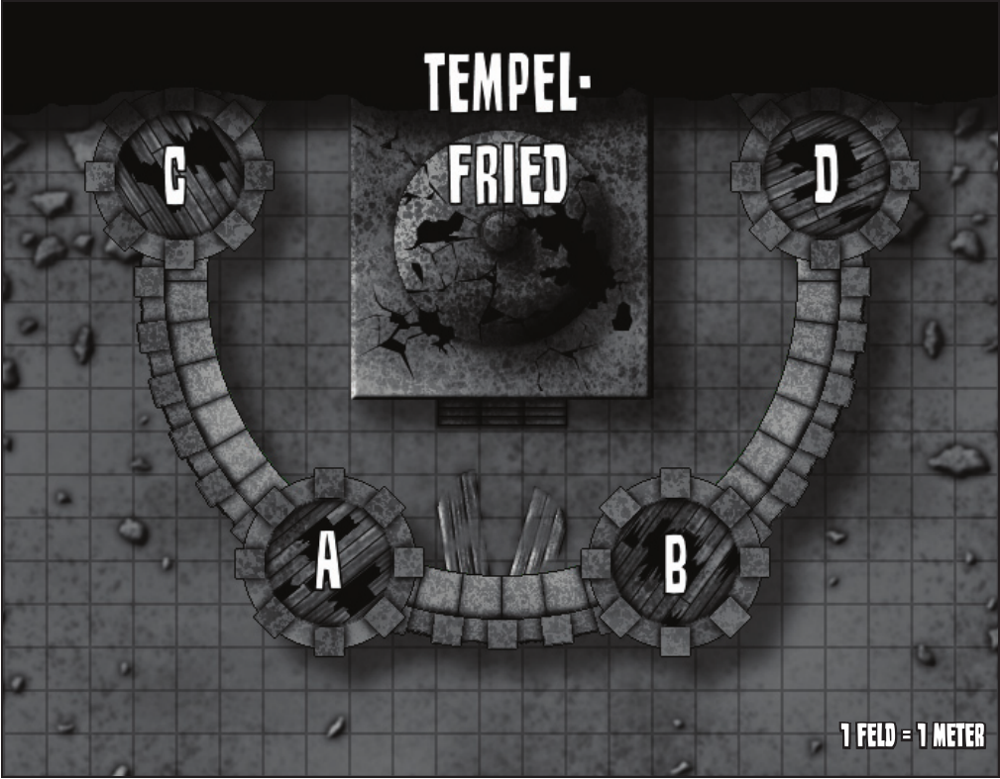
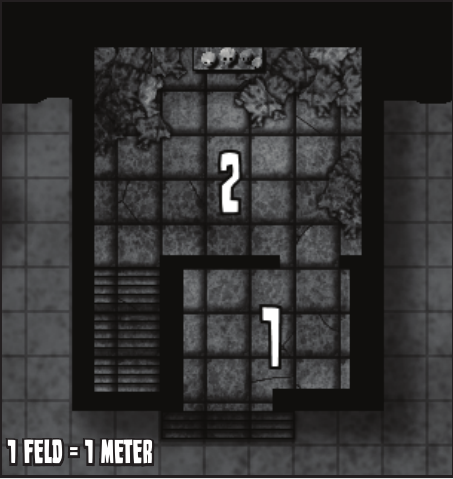
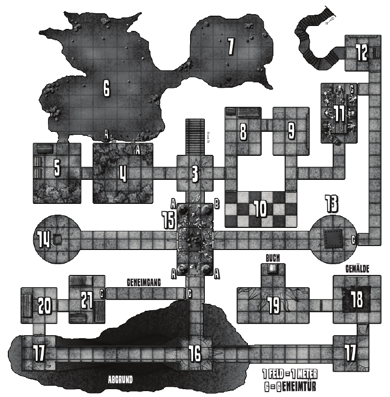

## Abenteuer 3: Festung des Unheils

**für 2+ Charaktere der 3.-5. Stufe**

Einst, vor langer Zeit, noch bevor die Zwerge Eisenhall bezogen, wachten Paladine des Lichts über die Tannhügel.

Der Orden ist schon Jahrhunderte fort, ihre Burg am Fuße des _Schmalstiegs_ gilt heutzutage als ein verfluchter Ort, nur noch bekannt als die _Festung des Unheils_.

In den Tannhügeln kann so gut wie jeder etwas über die _Festung des Unheils_ erzählen.

Immer wieder ließen sich Räuberbanden oder gefährliche Monster erneut in ihren Hallen nieder, weshalb es immer wieder abenteuerlustige Recken auf der Suche nach Ruhm und Reichtum in die Ruinen zieht, doch nur die Wenigsten kehrten zurück.

### DER SCHMALSTIEG

Die Festung des Unheils lehnt an einem steilen, schmalen Felskamm, genannt der
“Schmalstieg”. An seiner höchsten Stelle in 30m Höhe erkennt man bereits von Weitem die zerborstenen Überreste einer einst offenbar humanoiden Statue. Heute nicht mehr erkennbar, stellte diese Statue einst eine Gottheit des Lichts dar, wurde aber durch Mächte der Dunkelheit schon vor langer Zeit zerschmettert.

Eine schmale, hinter Felsen verborgene Treppe führt hinauf zum Gipfel, von wo aus man hinab in die Festung blicken kann. Ein Felsen in der Nähe der Statue verbirgt eine Geheimtür (TW 8), deren steile Stufen hinab in die Keller der Festung des Unheils zu **12** führen.

### DIE FESTUNG

Schon von Weitem ist klar zu erkennen, dass die Zeit ihre Spuren an der tempelartigen Festung hinterlassen hat:
Die Überreste der verrotteten Tore liegen im Staub, klaffende Risse durchziehen die bröckelnden Mauern, die verfallenen Türme scheinen jeden Moment einzustürzen und auch die Kuppeldecke des tempelartigen Burgfrieds zeigen starke Verfallspuren.

#### DERZEITIGE BEWOHNER

Bis vor zwei Monaten herrschte eine Goblinbande unter der Führung des Schamanen Shekz über die Festung des Unheils, doch dies änderte sich, als der südländische [Nekromant](charaktere-heldenklassen-nekromant.md) Ankmatur mit einer Bande Trolle auftauchte.

Inzwischen ist der [Nekromant](charaktere-heldenklassen-nekromant.md) der neue Herrscher über die Festung des Unheils, während er die Goblins versklavt und ihren Anführer Shekz eingesperrt hat.

Ankmatur hat einen Großteil der Keller bereits erkunden können, alte Fallen reaktiviert und aus den unzähligen Toten, die hier im Lauf der Jahrhunderte ums Leben kamen, Skelette und Schatten erschaffen.

Zu seiner Verwunderung entdeckte Ankmatur seltsam leuchtende Erzadern eines ihm völlig unbekannten Metalls, welches anscheinend nur im Schmalstieg vorkommt.

Während der [Nekromant](charaktere-heldenklassen-nekromant.md) weiter die Rätsel der Kellergewölbe untersucht, zwingen seine Skelette die Goblins, das seltsame Erz abzubauen.

Zwar ist der Hass auf den Nekromanten groß, am liebsten würden sie ihren Anführer Shekz befreien und Ankmatur den Garaus machen, doch die Furcht vor seiner schwarzen Magie und seinen Untoten hat die Goblins - zusammen mit der Kräfte zehrenden Arbeit - völlig entmutigt.

Auch den Charakteren wird im Verlauf des Abenteuers die Situation der versklavten Goblins bewusst werden. Vielleicht nutzen sie diesen Umstand und versuchen, sich dadurch einen Vorteil zu verschaffen:

Sowohl die Goblins als auch der Schamane Shekz können sich in der Gemeinsprache verständigen und würden sich bereitwillig mit den Charakteren gegen den Nekromanten verbünden, um endlich wieder frei (und im Besitz der Festung) zu sein.

  
(*© Christian Kennig*)

#### BETRETEN DER FESTUNG

Ankmatur fühlt sich in den Kellern sicher, weshalb er sich nicht um Wachen im Festungshof schert. Die Trolle im Tempelfried sind zu dumm, um darauf zu achten, was draußen geschieht.

### DIE TÜRME

Die baufälligen, je 6m hohen Türme (ohne Brüstung gerechnet) sind alle nur über einen 3m hohen Wehrgang zu erreichen. Leitern gibt es hier schon lange nicht mehr, doch die Wehrgangmauer bietet genug Griffmöglichkeiten (Klettern +8).

#### TURM A

Im Inneren gelangt man durch eine Luke ins Erdgeschoss, während die Holz stiege, die nach oben führten, schon lange eingestürzt sind (die Reste der Dächer würden eh niemanden mehr tragen). Die windschiefen Turmtüren sind alle unverschlossen. Alles in diesem stark eingefallenen Turm ist von Decken- und Mauertrümmern übersäht, die Luke ist völlig unter Schutt und Geröll begraben. Wer sie freilegt und öffnet, findet darunter lediglich ein leeres Kerkerloch.

#### TURM B

Wer hier Geräusche macht oder spricht, riskiert (PW: 5) einen kompletten Deckeneinsturz (Schlagen 40). Im Erdgeschoss befand sich einst eine kleine, schon vor Jahrhunderten geplünderte Waffenkammer der Paladine.

#### TURM C

In diesem (noch halbwegs intakten) Turm mit nur einer Tür lauert eine **_Rostassel_** unter Schutt und Staub (Bemerken -4).

#### TURM D

Ein Großteil der Außenwand ist vor langer Zeit eingestürzt. Wer hier etwas sucht, findet unter den Trümmern leicht (+2) das Skelett eines Elfen, dessen Hab und Gut - bis auf einen magischen Kurzbogen +1 und 8GM - nicht mehr zu gebrauchen ist.

### DER TEMPELFRIED

Das Sonnensymbol Helias ist noch immer gut über dem Eingangsportal des Bauwerks zu erkennen. Was auch immer mit den Türflügeln geschah - sie sind schon lange fort.

  
(*© Christian Kennig*)

#### 1. EINGANGSBEREICH

Wer den Eingangsbereich betritt, würfelt zwei Bemerken-Proben, ob er den Trollgestank riecht (+4) oder ihr dumpfes Gegrunze (+0) hört.

#### 2. ENTWEIHTER SCHREIN HELIAS

Zwischen Fellen, abgenagten Knochen, Dreck und Kot hausen die Trolle von Ankmatur in diesen einst so heiligen Hallen. Insgesamt befinden sich **\_zwei Trolle**\_ hier, die den Charakteren äußerst gefährlich werden können. Einer der beiden Trolle hält noch ein Nickerchen, muss also zunächst “erwachen” (siehe Seite 89).

Zwar sollen sie auch Eindringlinge abfangen, hauptsächlich sind sie jedoch hier, um die Goblins an der Flucht zu hindern (und weil es dort unten zu eng für sie ist). An der gegenüberliegenden Wand befindet sich ein kleiner Altar mit dem Sonnensymbolen Helias, der jetzt durch Schädel von Trollopfern (3 Goblins und 1 Zwerg) entweiht wird. Werden diese “Trophäen” entfernt und der Altar gesäubert, erhält jeder dies befürwortende Charakter (außer **Dienern der Dunkelheit**) für W20 Stunden einen Bonus von +1 auf alle Proben. Eine einzelne Treppe führt hinab in den Kellerkomplex.

  
(*© Christian Kennig*)

### DER KELLERKOMPLEX

Das Kellergewölbe ist grob in drei Bereiche aufgeteilt: Der **Sklavenbereich (Räume 4-9)** der Goblins, die **Kammern des Nekromanten (Räume 13-21)** und die **unberührten Hallen (Räume 8-12)**, in die Ankmatur noch keinen weiteren Vorstoß gewagt hat. Sämtliche Türen - sofern nicht anders gekennzeichnet - sind unverschlossen.

#### 3. EINGANGSBEREICH

Ein abgenutztes Bodenfresko einer Sonne - Symbol Helias, der Göttin des Lichts - verziert den Boden. Die **Tür zu 8** ist durch ein neuwertiges Vorhängeschloß (SW 4) gesichert.

#### 4. GOBLINSCHLAFKAMMER

Hier schlafen auf schmutzigen, aber dennoch leicht schimmernden Fellen und Decken (der Staub des leuchtenden Metalls) die Goblinsklaven. Derzeit ist kein Goblin hier, es wird gearbeitet, was man durch die engen Sichtfenster (A) zu **6** auch hier hören kann.

#### 5. LAGERKAMMER

Neben weiteren Schlafstellen befinden sich hier 3 Truhen, von denen die größte mit 8 Spitzhacken beladen ist. Die beiden kleineren Truhe enthalten dagegen leicht schimmernde Steinbrocken, die das seltsame Metall enthalten, dass die Goblins abbauen müssen. Von 6 her hört man Geklopfe, Gestöhne und Peitschenknallen.

#### 6. ARBEITSHÖHLE

An der dem Eingang gegenüberliegenden Wand hacken **_3 Goblins pro Charakter_** Gesteinsbrocken aus der schimmernden Felsenwand. **_4 Skelette_** mit Peitschen - der Tür zu **5** den Rücken gekehrt - “motivieren” die Sklaven bei ihrer Arbeit. Die Goblins werden nur in den Kampf eingreifen, wenn sie selbst attackiert werden oder aber die Charaktere zu unterliegen scheinen,woraufhin sie die Skelette unterstützen!

#### 7. NEBENHÖHLE

Hier arbeiten - äußerst langsam - sechs verwesende Zombiegoblins an der gegenüberliegenden Wand, eine Mahnung für die noch lebenden Goblins, was ihnen bei Ungehorsam droht. Die primitiven Arbeiterzombies stellen keine sich wehrenden Gegner dar und verfügen jeweils nur über 1LK, würfeln keine Abwehr und sind 0EP wert.

#### 8. ALTE KAMMER

Ankmatur war noch nicht hier, die Zugangstür bei **3** hat er verschließen lassen.

Im Schrank hängt ein Mantel der Augen (siehe Seite 100) und ein schwarze Kutte, die dem Träger +1 auf Stärke gewährt. Wer die Kutte ein 2. Mal untersucht, kann einen weiteren Effekt feststellen: Jede Nacht besteht eine Chance (1 auf W20), dass die Kutte sich und ihren Träger bis zum Morgengrauen zu Stein erstarren lässt.

Alte Blutflecken vor der Truhe stammen von der von oben hinabstoßenden Speerfalle (TW 4, Schlagen 15), die im Anschluß wieder blitzschnell in einer Öffnung in der Decke verschwindet). Die Truhe enthält ein altes, 10m langes Seil (nur mit Magie durchtrennbar), 6 Tränke (6x Beutetabelle T) und eine Blechbüchse mit 7 roten Bonbons (heilen 2W20 Runden einzeln gelutscht 1LK/Runde).

#### 9. ALTE WAFFENKAMMER

Neben den 4 Kurzschwertern, 8 Bihändern, 14 Metallschilden, 7 Ketten- und 5 Plattenpanzern befindet sich hier auch **_vier fliegende Schwerter_**, die auf ihre Chance lauern.

#### 10. KORRIDOR DER FLIESEN

Ankmatur war noch nicht hier, die Zugangstür bei **3** hat er verschließen lassen.

Bei Betreten einer Fliese wirkt diese einen magischen Effekt (Abklingzeit: 1 Jahr) auf den jeweiligen Charakter.

Der Spieler ermittelt den Effekt mit W20, wobei helle Fliesen den Wert um 2 senken und dunkle ihn um 2 erhöhen:

| ERGEBNIS | EFFEKT DER FLIESE                            |
| :------: | -------------------------------------------- |
|    1     | oder niedriger zuf. Eigenschaft permanent +1 |
|    2     | der Charakter erhält 1 Talentpunkt           |
|   3-4    | Münzen des Charakters +50%                   |
|   5-8    | Etwas erscheint (Beutetabelle M)             |
|   9-12   | Zaubereffekt (Beutetabelle Z)                |
|  13-15   | W20/2 Min. in Ratte verwandelt               |
|  16-17   | W20 Minuten erstarrt                         |
|    18    | Charakter altert W20/2 Jahre                 |
|    19    | Traumatische Vision: -2W20 EP                |
|   20+    | 2W20 abwehrloser Schaden                     |

#### 11. DER LEICHENSCHMAUS

GEMÄLDE An einem Tisch mit verwesten Speisen und Bechern voll Staubfäden sitzen starr **_5 Skelette_**, man hört dumpfes Gebrabbel und Besteckklappern. Die Skelette erheben sich nur zum gemeinsamen Angriff, wenn man versucht, einem von ihnen den Goldring (1 pro Skelett) mit Sonnensymbol abzunehmen (heilt einmal pro Kampf LK in Höhe des Ranges, den der Träger in **Diener des Lichts** hat).Eine weitere Besonderheiten stellen die 5 unscheinbaren Metallkelche dar: Einmal täglich füllen sich diese magisch mit Wasser oder Wein, je nachdem, was ihr Besitzer sich wünscht. Die **Geheimtür zu 12** ist von dieser Seite verborgen (TW 8).

#### 12. FLUCHTTUNNEL

Früher wachte stets ein [Paladin](charaktere-heldenklassen-paladin.md) in diesem Raum, der den Zugang zum gut 30m langen Fluchttunnel bildet. Der Tunnel wurde bis jetzt von niemandem entdeckt. Eine unverschlossene Truhe enthält die staubigen Überreste von Trockenproviant, sowie 8 Heiltränke und 6 Holzschachteln mit (ausgetrockneter) Waffenpaste.

Im Waffenständer stehen 8 Langschwerter, zwei davon haben einen sonnenverzierten Griff und sind magisch +1.

Die Geheimtüren zu **11** und **13** sind von hier aus nicht getarnt.

#### 13. SHEKZ’ KÄFIG

In einem großen, massiven Eisenkäfig (SW 4) hält Ankmatur den Goblinschamanen Shekz gefangen, der sich allzu gern mit den Charakteren gegen den verhassten Nekromanten verbünden würde.

#### 14. THRON DES HEILENDEN SCHLAFS

Wer hier Platz nimmt, wird schrecklich müde und binnen W20/10 Runden einschlafen, wenn er nichts dagegen unternimmt. Charaktere sind nicht wach zu bekommen (außer _Allheilung_), erwachen aber nach W20 Minuten von alleine und haben wieder volle Lebenskraft, sofern sie verletzt waren.

#### 15. HALLE DER WÄCHTER

Hier stehen drei massive, schimmernde Statuen (A) aus dem seltsamen Gestein auf Sockeln. Ein vierter Sockel (B) ist leer, die Überreste der Statue liegen zertrümmert neben unzähligen Knochen und Abenteurerresten am Boden. Die 3 Statuen (Werte wie **_Lehmgolems_**) greifen jeden außer Ankmatur und seine Untoten an, sobald man die bronzenen Doppeltüren zu **13** bzw. **14** oder die Eisentür zu **16** öffnet.

#### 16. DIE GROSSE HÖHLE

Dieser Bereich ist über die Geländer zu erreichen - zur Decke sind es knapp 4m, zum Boden, wo diverse Knochen schimmern, sind es 6m. Die bleichen Faulbäuche bei **17** sind von hier aus schon gut zu erkennen.

#### 17. DIE FAULBÄUCHE

An beiden Stellen steht je ein bleiches, dickwanstiges Zombieungetüm. Sobald einer der **_2 Faulbäuche_** angegriffen wird, bewegen sich beide auf die Charaktere zu, während sich **_pro Charakter 1 Skelett_** am Boden des Abgrunds (**16**) erhebt und in 2 Runden oben ankommt. “Geschleuderte” stürzen 6m tief in den Abgrund (18 abwehrbare Schadenspunkte).

Ein Faulbauch mit 0 LK zerplatzt spritzend und hinterlässt 3 Faulbauchmaden:

#### 18. KAMMER DER BESINNUNG

Ein Gemälde an der gegenüberliegenden Wand zeigt die strahlende, stolze Festung zur Zeit der Paladine.

Der zerfranste, magische Teppich halbiert die Abklingzeit von Zaubern, solange ein [Zauberwirker](charaktere-klasse-zauberwirker.md) mit **Diener des Lichts** auf ihm steht.

#### 19. DER FOLIANT DES WISSENS

Ein dicker, staubiger Foliant mit leeren Seiten steht hier auf einem Sockel, abgegrenzt durch ein Sonnensymbol am Boden. **Diener bzw. Wesen der Dunkelheit**, die über diese Bogenlinie treten oder das Buch berühren, erhalten W20 nicht abwehrbaren Schaden pro Runde).

Charaktere mit **Diener des Lichts**, die das Buch berühren, verpuffen in einer Wolke und erscheinen in einer gewaltigen, alten Bibliothek (in Wahrheit sind sie im Buch). Für Nachforschungen aller Art bzw. um die Buchbibliothek wieder zu verlassen, würfelt man GEI+VE+4, allerdings vergehen pro Wurf in der normalen Welt W20 Stunden. Nichts kann aus der Bibliothek entfernt werden. Erleidet der Foliant Schaden, ist auch sein “Bewohner” mehr als gefährdet.

#### 20. ANKMATUR’S ARBEITSRAUM

Auf dem Tisch stehen alchemistische Instrumente (ein Werkzeug-Set, das +2 auf Alchemie-Proben gewährt) neben Brocken des schimmernden Gesteins.

Jede Runde, in der die Charaktere hier Geräusche machen, besteht die Chance, dass Ankmatur sie durch die Tür (-2) hört.

Daraufhin wird er durch den Geheimgang fliehen (das Zuklappen der Geheimtür können die Charaktere durch die Tür mit -2 hören). Wurden seine Untergebenen gänzlich vernichtet, wird er aus den toten Trollen neue Faulbäuche schaffen und den Charakteren im Hof auflauern.

#### 21. ANKMATUR’S KAMMER

Hier hält sich Ankmatur zur Zeit auf, sollte er nicht bereits durch die **Geheimtür (TW 4)** geflohen sein (siehe **20**). Der Schrank enthält nur zwei einfache Leinenroben, doch in der Truhe sind 414GM, 211SM, diverse Tränke (8 x Beutetabelle T) und Schriftfrollen (6 x Beutetabelle Z), der Schlüssel zu Shekz’ Käfig (**13**) sowie das Buch “Herr der Toten”, das dem Träger +3 auf das Erwecken von Untoten gewährt.

### Erfahrungspunkte

- Pro Raum: 1EP
- Kampf: (besiegte EP/SC)EP
- Rollenspiel: 0-50 EP
- Für das Abenteuer: 75EP

## NSC-Werte

### Shekz

- Gruppe: Humanoide

| KÖR     |  3  | AGI        |  5  | GEI        |  7  |
| :------ | :-: | :--------- | :-: | :--------- | :-: |
| ST      |  0  | BE         |  0  | VE         |  4  |
| HÄ      |  1  | GE         |  2  | AU         |  4  |
|         |     |            |     |            |     |
| LK      |  7  | Abwehr     |  5  | Initiative |  5  |
| Laufen  | 3.5 | Schlagen   |  3  | Schiessen  |  7  |
| Zaubern | 11  | Zielzauber |  9  |            |     |
|         |     |            |     |            |     |
| GH      |  1  | GK         | kl  | EP         | 49  |

| Bewaffnung |
| :--------: |
| Wurfmesser |

|  Panzerung   |
| :----------: |
| Felle (PA+1) |

**Nachtsicht:** Kann bei einem Mindestmaß an [Licht](../../grw/zauber/licht.md) noch sehen wie am helllichten Tag.

**Wesen der Dunkelheit (Settingoption):** Gilt in den meisten Settings als ein Wesen der Dunkelheit. Angewendete Regeln für Wesen der Dunkelheit gelten für diese Kreatur.

**Zauber:** _Einschläfern [!] (-(KÖR+VE)/2)_

**Zielzauber:** [Feuerstrahl](../../grw/zauber/feuerstrahl.md) (+1)

### Faulbauch

- Gruppe: Untote

| KÖR    | 16  | AGI      |  6  | GEI        |  0  |
| :----- | :-: | :------- | :-: | :--------- | :-: |
| ST     |  6  | BE       |  0  | VE         |  0  |
| HÄ     |  5  | GE       |  0  | AU         |  0  |
|        |     |          |     |            |     |
| LK     | 62  | Abwehr   | 23  | Initiative |  6  |
| Laufen | 4.5 | Schlagen | 24  | Schiessen  |     |
|        |     |          |     |            |     |
| GH     | 17  | GK       | gr  | EP         | 131 |

|      Bewaffnung      |
| :------------------: |
| Knochenpranke (WB+2) |

|      Panzerung      |
| :-----------------: |
| Merkt nichts (PA+2) |

**Dunkelsicht:** Kann selbst in völliger Dunkelheit noch sehen.

**Geistesimmun:** Immun gegen geistesbeeinflussende Effekte (Bezauberungen, Einschläferung, Hypnose usw.) und [Zauber](../../fanwerk/zauber/zauber.md), die mit [!] gekennzeichnet sind.

**Schleudern:** Schlagen-Immersieg schleudert das Ziel (sofern 1+ Größenkategorie kleiner) Schaden/3 m fort. Das Ziel erleidet für die Distanz Sturzschaden, gegen den es normal Abwehr würfelt, und liegt am Boden.

**Wesen der Dunkelheit (Settingoption):** Gilt in den meisten Settings als ein Wesen der Dunkelheit. Angewendete Regeln für Wesen der Dunkelheit gelten für diese Kreatur.

### Faulbauchmade

- Gruppe: Untote

| KÖR    |  6  | AGI      |  6  | GEI        |  0  |
| :----- | :-: | :------- | :-: | :--------- | :-: |
| ST     |  2  | BE       |  0  | VE         |  0  |
| HÄ     |  4  | GE       |  0  | AU         |  0  |
|        |     |          |     |            |     |
| LK     | 10  | Abwehr   | 10  | Initiative |  6  |
| Laufen |  4  | Schlagen | 10  | Schiessen  |     |
|        |     |          |     |            |     |
| GH     |  1  | GK       | kl  | EP         | 47  |

|     Bewaffnung     |
| :----------------: |
| Zahnschlund (WB+2) |

| Panzerung |
| :-------: |
|           |

**Dunkelsicht:** Kann selbst in völliger Dunkelheit noch sehen.

**Geistesimmun:** Immun gegen geistesbeeinflussende Effekte (Bezauberungen, Einschläferung, Hypnose usw.) und [Zauber](../../fanwerk/zauber/zauber.md), die mit [!] gekennzeichnet sind.

**Natürliche Waffen:** Bei einem Schlagen-Patzer gegen einen Bewaffneten wird dessen Waffe getroffen. Der Angegriffene würfelt augenblicklich & aktionsfrei einen Angriff mit seiner Waffe gegen die patzende Kreatur.

**Gruppe**: Untote

### Ankmatur

- Gruppe: Humanoide
- Volk: Mensch
- Klasse: Nekromant 10
- Volksfähigkeiten: Talentiert

| KÖR     |  4  | AGI        |  8  | GEI        |  8  |
| :------ | :-: | :--------- | :-: | :--------- | :-: |
| ST      |  0  | BE         |  0  | VE         |  6  |
| HÄ      |  4  | GE         |  2  | AU         |  5  |
|         |     |            |     |            |     |
| LK      | 18  | Abwehr     | 10  | Initiative |  9  |
| Laufen  |  5  | Schlagen   |  7  | Schiessen  |     |
| Zaubern | 13  | Zielzauber | 10  |            |     |
|         |     |            |     |            |     |
| GH      |  1  | GK         | no  | EP         | 83  |

|           Bewaffnung            |
| :-----------------------------: |
| Langschwert (WB+3, INI+1, GA-1) |

|  Panzerung  |
| :---------: |
| Robe (PA+2) |

**Zauber:** [Kontrollieren](../../grw/zauber/kontrollieren.md) (-(GEI+AU)/2), [Skelette erwecken](../../grw/zauber/skelette-erwecken.md), [Terror](../../grw/zauber/terror.md) [!] (-(GEI+VE)/2), [Totengespräch](../../grw/zauber/totengespraech.md), [Verwirren](../../grw/zauber/verwirren.md) [!] (-(GEI+AU)/2), [Zombies erwecken](../../grw/zauber/zombies-erwecken.md), [Öffnen](../../grw/zauber/oeffnen.md) (-SW)

**Zielzauber:** [Feuerball](../../grw/zauber/feuerball.md) (+3), [Schattenpfeil](../../grw/zauber/schattenpfeil.md) (+2)
