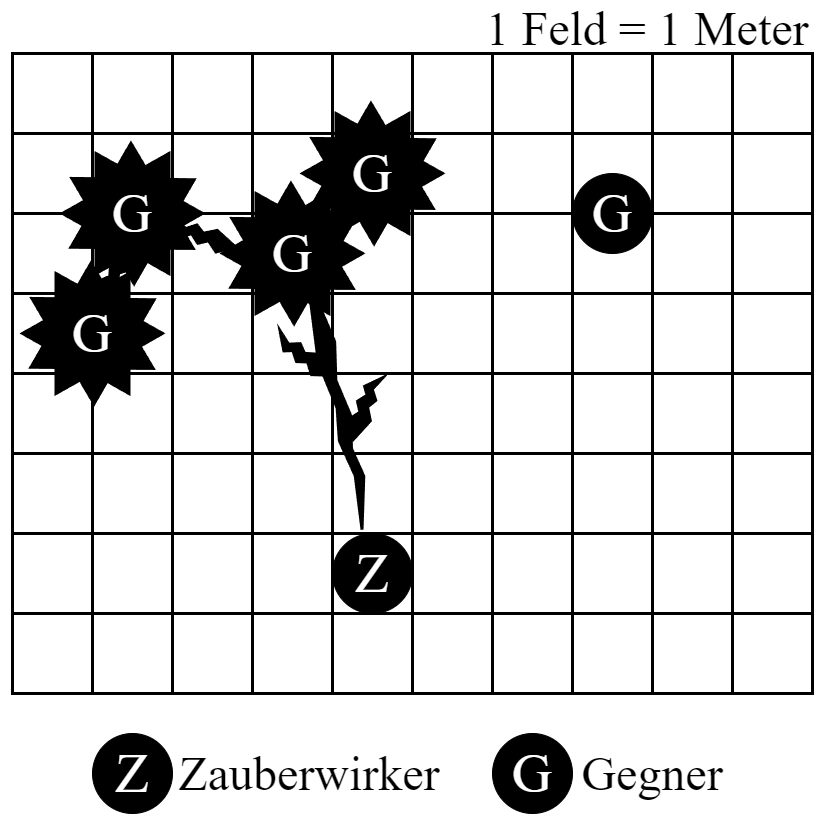

### Kettenblitz

- Kategorie: #Zauber
- Zugangsstufen:
  - Heiler: 16
  - Zauberer: 10
  - Schwarzmagier: 10
- Preis: 460GM
- ZB: +3
- Dauer: Augenblicklich
- Distanz: VE x 5 m
- Abklingzeit: 5 Kampfrunden
- Art: Zielzauber

Der ZAW schießt einen Blitz auf einen Feind, der auf bis zu VE weitere Gegner in seiner Nähe überspringt.

Nur Gegner, die 2 oder mehr m von einem ihrer getroffenen Mitstreiter entfernt stehen, kann der Kettenblitz nicht erreichen (sh. GRW S. 60).

Getroffene Gegner in Metallrüstung dürfen keine Abwehr gegen einen Kettenblitz würfeln.

---

Quelle: GRW
